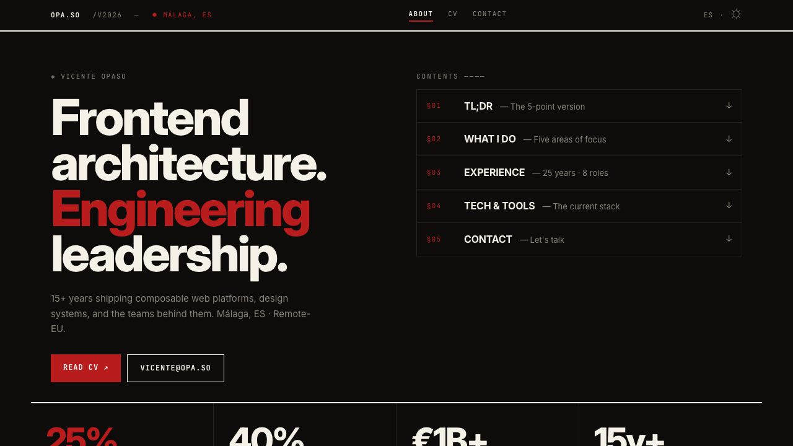

<!-- CI -->
<div align="center">
  
  
  
  
  
  
  
</div>
<br />

<br />

# Opa.so

This repo contains the source for my personal site and CV, built with Next.js App Router and a content-first approach. It renders a Home page at the root (`/`) and a structured CV at `/cv` from markdown/JSON content, and includes a spam‑protected contact flow using Cloudflare Turnstile and Formspree.

The project is optimized for readability, accessibility, and maintainability, with a focus on composable UI, modern tooling, and strong Developer Experience.

---

## System Design & Development (SDD)

- The machine-readable System Design & Development Spec lives at `./sdd.yaml` and is the authoritative source of truth for principles, boundaries, and CI expectations.
- Documentation-first: propose changes by updating the SDD (`sdd.yaml`) and relevant docs before (or alongside) code.
- Solution-agnostic: architecture principles and governance in the SDD apply regardless of specific frameworks or libraries; the tech stack described below reflects the current implementation, not a mandate.
- PRs that change architecture or cross-cutting behavior should update `sdd.yaml` and relevant docs.

## Tech stack

<!-- Stack -->

[](https://vicenteopaso.vercel.app)


- **Framework**: Next.js (App Router, `app/` directory, typed routes)
- **Language**: TypeScript, React 19
- **Styling**: Tailwind CSS v4, custom design tokens, utility classes (e.g. `shell`, `section-card`)
- **UI primitives**: Radix UI (`@radix-ui/react-*`) for navigation, dialogs, avatars
- **Theming**: `next-themes` for light/dark mode with `class` attribute on `<html>`
- **Content**:
  - Markdown in `content/about.md`
  - Markdown + JSON CV in `content/cv.md`
  - Contentlayer integration (`contentlayer.config.ts`, `next-contentlayer`) for structured content
  - Shared ReactMarkdown components config in `lib/markdown-components.tsx` for consistent typography on policy/governance docs
- **Forms / backend**:
  - Cloudflare Turnstile for bot protection
  - Next.js Route Handler (`app/api/contact/route.ts`) for contact form
  - Formspree as the actual email backend
- **Tooling**:
  - ESLint (Next.js, TypeScript, JSX a11y, Prettier)
  - Prettier
  - Vitest (unit tests, jsdom)
  - Playwright (end‑to‑end tests)
  - Husky + lint-staged (pre‑commit checks)
  - TypeScript strict typechecking

---

## Project structure

High‑level layout:

- `app/`
  - `layout.tsx` – Root HTML shell, global styles, SEO metadata, theme provider, and Sentry integration.
  - `[lang]/` – Locale-specific routes (e.g., `/en/`, `/es/`)
    - `layout.tsx` – Locale layout wrapper for i18n validation
    - `page.tsx` – Home route for each locale. Reads `content/[locale]/about.md` and renders it via `react-markdown` configured with `introComponents`/`aboutPageComponents` from `lib/markdown-components.tsx`, plus a profile card, intro section, rotating impact cards, social links, and a contact section.
    - `cv/page.tsx` – Reads `content/[locale]/cv.md`, parses the JSON CV body, and renders experience, skills, education, languages, interests, publications, and references.
    - `cookie-policy/page.tsx` – Markdown‑backed cookie policy page rendered with shared `markdownComponents`.
    - `privacy-policy/page.tsx` – Markdown‑backed privacy policy page rendered with shared `markdownComponents`.
    - `accessibility/page.tsx` – Accessibility statement page.
    - `tech-stack/page.tsx` – Technical stack documentation page.
    - `technical-governance/page.tsx` – Technical governance documentation page.
  - `components/`
    - `Header.tsx`, `Footer.tsx` – Layout chrome.
    - `NavigationMenu.tsx` – Radix navigation menu with theme toggle, logo, and contact trigger.
    - `ProfileCard.tsx` – Hero/profile card, with stable portraits by theme and initials fallback.
    - `Modal.tsx` – Shared Radix dialog wrapper with consistent styling and optional Vercel Analytics tracking on open.
    - `ContactDialog.tsx` – Contact form dialog implemented on top of `Modal`, including Turnstile integration.
    - `CookiePolicyModal.tsx`, `PrivacyPolicyModal.tsx`, `TechStackModal.tsx` – Footer modals that fetch markdown content via `/api/content/[slug]` and render with `react-markdown` using shared `markdownComponents` from `lib/markdown-components.tsx`.
    - `ImpactCards.tsx` – Rotating impact cards for the Home page, rendering markdown snippets with subtle animations.
    - `ReferencesCarousel.tsx` – Auto‑rotating carousel for CV references.
    - `ThemeProvider.tsx` – Wraps `next-themes` configuration.
    - `icons.tsx` – Shared icon primitives (GitHub, LinkedIn, X, download, and small glyph icons).
  - `api/contact/route.ts` – Validates and forwards contact form submissions (Turnstile verification + Formspree).
  - `api/content/[slug]/route.ts` – Serves markdown content (cookie policy, privacy policy, tech stack) as JSON `{ title, body }` for use by modals and pages.
- `content/`
  - `en/` – English content (source of truth)
    - `about.md` – Frontmatter + markdown body for the Home page.
    - `cv.md` – Frontmatter + JSON object in the markdown body for the CV.
    - `cookie-policy.md` – Markdown source for the cookie policy.
    - `privacy-policy.md` – Markdown source for the privacy policy.
    - `tech-stack.md` – Markdown source for the tech stack page.
    - `accessibility.md` – Markdown source for the accessibility statement.
    - `technical-governance.md` – Markdown source for the technical governance page.
  - `es/` – Spanish translations (auto-generated via DeepL)
    - Mirror structure of `en/` directory
- `i18n/` – UI string dictionaries for internationalization
  - `en/ui.json` – English UI strings
  - `es/ui.json` – Spanish UI strings (auto-generated via DeepL)
- `lib/` – Shared utilities and services
  - `i18n/` – Internationalization utilities (locale detection, translation loading)
  - `seo.ts` – SEO configuration and metadata helpers
  - `error-logging.ts` – Centralized error logging with Sentry
  - `markdown-components.tsx` – Shared ReactMarkdown component mappings
  - `sanitize-html.ts` – HTML sanitization for XSS prevention
  - `rate-limit.ts` – In-memory rate limiting for API routes
- `styles/globals.css` – Tailwind CSS v4 setup, design tokens, global typography, layout utilities.
- `scripts/`
  - `build.mjs` – Contentlayer + Next.js build orchestration.
  - `clean-local.mjs` – Cleans local artifacts (`.next`, `.turbo`, `.contentlayer`, `.vercel`, coverage, Playwright artifacts, etc.).
  - `audit-a11y.mjs` – Lightweight, non-blocking accessibility audit (run via the `accessibility.yml` workflow).
  - `validate-links.mjs` – Validates internal markdown links against known app routes (run in the main `ci.yml` workflow).
- Config:
  - `next.config.mjs` – Next.js config wrapped in `withContentlayer`.
  - `tailwind.config.js` – Tailwind content globs for `app/`, `components/`, and `content/`.
  - `tsconfig.json` – Strict TS config with path mapping for `@/*` and `contentlayer/generated`.
  - `.eslintrc.json`, `.prettierrc`, `.husky/`, `.github/workflows/*.yml`, etc.

> Note: `app/page.tsx` and `app/cv/page.tsx` currently read from the filesystem at runtime rather than querying Contentlayer. Any refactor should keep the existing behavior (especially the JSON‑driven CV and its error handling) or migrate fully to Contentlayer with equivalent semantics.

---

## Getting started

> For contribution-specific details (pnpm usage, common commands, and workflow expectations), see `CONTRIBUTING.md`.

### Prerequisites

- Node.js (LTS recommended)
- pnpm (preferred package manager for this project)

### Installation

```bash
pnpm install
```

### Running the dev server

```bash
pnpm dev
```

Then open `http://localhost:3000` in your browser.

The main routes are:

- `/` or `/en` – English About page (markdown‑driven, default locale)
- `/es` – Spanish About page (auto-translated)
- `/en/cv` – English CV page (JSON-driven)
- `/es/cv` – Spanish CV page (auto-translated)
- `/en/cookie-policy` – English cookie policy page
- `/es/cookie-policy` – Spanish cookie policy page
- `/en/privacy-policy` – English privacy policy page
- `/es/privacy-policy` – Spanish privacy policy page
- `/en/accessibility` – English accessibility statement
- `/es/accessibility` – Spanish accessibility statement
- `/en/tech-stack` – English tech stack documentation
- `/es/tech-stack` – Spanish tech stack documentation
- `/en/technical-governance` – English technical governance documentation
- `/es/technical-governance` – Spanish technical governance documentation
- `/api/contact` – Contact form API route
- `/api/content/[slug]` – Content API for policy/tech markdown (deprecated, pages now server-side rendered)

---

## SEO and sitemaps

The site includes sitemap generation via `next-sitemap`. The configuration is in `next-sitemap.config.js` and uses the canonical site URL from `lib/seo.ts`.

- Generate the sitemap:
  ```bash
  pnpm build  # Build is required first
  pnpm sitemap
  ```
- Output files:
  - `public/sitemap.xml` – Main sitemap index.
  - `public/sitemap-0.xml` – Sitemap containing all routes.
- `public/robots.txt` references the sitemap URL, pointing search engines to the XML.

---

## Editing content

### About page (`/`)

- Source file: `content/about.md`
- Frontmatter fields:
  - `name` – Display name
  - `title` – Used for metadata / page title
  - `slug` – Should be `about`
  - `tagline` – One‑line descriptor used in the profile card
  - `initials` – Used for avatar fallback
- Body structure:
  - The markdown body is split into sections using horizontal rules (`---`).
  - The first section is treated as an **Introduction**:
    - An optional `### Introduction` heading is stripped.
    - The remaining copy is rendered with larger, cardless typography.
  - Remaining sections are rendered as:
    - Standard markdown sections with `react-markdown` and the shared `aboutPageComponents` mapping from `lib/markdown-components.tsx` (headings, lists, links, inline code, separators).
    - A special **Impact Cards** section, when a section starts with `### Impact Cards`:
      - Individual cards are separated by `***` lines.
      - Each card block is rendered by `ImpactCards` as a rotating impact card on the About page.

### CV page (`/cv`)

- Source file: `content/cv.md`
- Frontmatter fields:
  - `name`, `title`, `slug: cv`
- Body: A **single JSON object**, parsed at runtime into a `CvJson` structure. Key fields include:
  - `basics` – Name, label, summary, highlights (with optional titles and HTML content).
  - `work` – Companies, locations, positions, date ranges, highlights, and skills.
  - `education`, `skills`, `languages`, `interests`, `publications`, `references`.

- Some fields contain HTML strings (e.g. `references[*].reference`), which are injected with `dangerouslySetInnerHTML` in both `CVPage` and `ReferencesCarousel`.
  - These HTML strings are sanitized via a whitelist-based sanitizer in `lib/sanitize-html.ts` before rendering to guard against XSS.

If the JSON is invalid, the CV page will:

- Render a fallback message.
- Show an error prompting you to fix `content/cv.md`.

---

## Internationalization (i18n)

The site includes automated translation support using DeepL to generate Spanish translations from English source content.

### Directory structure

The i18n directory structure is provided by the base i18n infrastructure:

- `content/en/` – English source content files (markdown)
- `content/es/` – Spanish translations (auto-generated by DeepL workflow)
- `i18n/en/ui.json` – English UI strings dictionary
- `i18n/es/ui.json` – Spanish UI strings (auto-generated by DeepL workflow)

### Translation workflow

The translation workflow is automated via GitHub Actions and only runs when English content changes:

1. **Manual translation** (for testing locally):

   ```bash
   DEEPL_API_KEY=your-api-key pnpm translate
   ```

2. **Automated translation** (CI):
   - Triggered automatically when changes are pushed to `content/en/**` or `i18n/en/**`.
   - The workflow runs `scripts/translate.mjs` to generate Spanish translations.
   - Translated files are committed back to the repository.

### Translation script behavior

The translation script (`scripts/translate.mjs`):

- Only translates new or changed content (uses content hashing for change detection).
- Translates markdown/MDX files from `content/en/` to `content/es/`.
- Translates UI strings from `i18n/en/ui.json` to `i18n/es/ui.json`.
- Preserves existing translations to minimize API calls.
- Includes rate limiting to respect DeepL API quotas.

### Required environment variables

To use the translation feature:

- `DEEPL_API_KEY` – Your DeepL API authentication key (required for translation).

This key must be added as a GitHub secret for the automated workflow to function.

### i18n Routing Implementation

The application implements localized routes using Next.js App Router's dynamic segments:

- Routes are organized under `app/[lang]/` for locale-specific pages
- Supported locales: `en` (English), `es` (Spanish)
- Default locale: English (`en`)
- Locale detection and validation via `lib/i18n/`
- UI strings localized via dictionaries in `i18n/[locale]/ui.json`
- Content localized via markdown files in `content/[locale]/`

The translation infrastructure provides full i18n support with automated DeepL translations for Spanish content.

---

## Contact flow

The contact flow is:

1. **Client dialog** (`ContactDialog.tsx`)
   - Radix `Dialog` with:
     - Required email and message fields.
     - Optional phone field.
     - Hidden `website` field (honeypot) for basic spam protection.
     - Hidden `domain` field, set to `https://opa.so`.
   - Integrates **Cloudflare Turnstile**:
     - The Turnstile script is loaded globally in `app/layout.tsx`.
     - A global `window.onTurnstileSuccess` callback receives the token.
     - The widget is inserted into a `<div className="cf-turnstile" ...>` container.
   - On submit, sends `POST /api/contact` with:
     - `email`, `phone?`, `message`, `domain?`, `turnstileToken`, `honeypot?`.

2. **API route** (`app/api/contact/route.ts`)
   - Validates payload with `zod`.
   - Anti‑spam & origin checks:
     - If `honeypot` is non‑empty → return `{ ok: true }` and do nothing else.
     - If `domain` is present and not equal to the allowed domain → `400` error.
   - Turnstile verification:
     - Requires `TURNSTILE_SECRET_KEY` in the environment.
     - Reads client IP from `x-forwarded-for` or `cf-connecting-ip` if present.
     - Calls `https://challenges.cloudflare.com/turnstile/v0/siteverify`.
   - **Basic rate limiting**:
     - Uses a simple in-memory counter (`lib/rate-limit.ts`) keyed by client IP.
     - Allows a small number of requests per minute and then responds with `429 Too Many Requests`.
     - Includes a `Retry-After` header and a user-friendly error message, and does **not** call external services when the limit is exceeded.
   - On success:
     - Forwards the payload to a Formspree endpoint.
   - On failure:
     - Returns appropriate `4xx`/`5xx` responses with generic messages (no internal details leaked).

### Required environment variables

To enable the contact form:

- `NEXT_PUBLIC_TURNSTILE_SITE_KEY` – Public site key used on the client.
- `TURNSTILE_SECRET_KEY` – Secret key used server‑side for Turnstile verification.

The Formspree endpoint is hard‑coded in the route handler; update it there if you change providers or form IDs.

---

## Scripts

All scripts are defined in `package.json` and intended to be run via pnpm.

### Core scripts

```bash
# Dev server (Next.js, port 3000)
pnpm dev

# Production build
pnpm build

# Start production server (after `pnpm build`)
pnpm start

# Generate sitemap (requires `pnpm build` first)
pnpm sitemap
```

### Composite scripts

These are designed for common developer workflows.

```bash
# Full local reset: wipes environment (node_modules, caches) and rebuilds
pnpm reset

# Full local verification: runs everything needed to guarantee correctness (mirrors CI)
pnpm verify
```

- **`reset`** — Cleans all build artifacts and caches, reinstalls dependencies, and rebuilds the project. Use after upgrading dependencies, switching branches with lockfile changes, or when the environment is in an inconsistent state.
- **`verify`** — Runs the full verification pipeline: install → lint → typecheck → validate:links → test → test:e2e → build. Use before pushing changes to ensure local correctness matches CI expectations. Requires Playwright browsers to be installed (`npx playwright install --with-deps`).

### Content & build

```bash
# Build Contentlayer output into `.contentlayer/generated`
pnpm content

# Full content + app build (via custom script)
node scripts/build.mjs
```

### Linting & formatting

```bash
# Lint TypeScript/JavaScript
pnpm lint

# Lint and auto-fix
pnpm lint:fix

# Check formatting with Prettier
pnpm format

# Auto-fix formatting
pnpm format:fix
```

### Quality checks

```bash
# Validate internal markdown links against known app routes
pnpm validate:links

# Run accessibility audit
pnpm audit:a11y

# Run security audit (high+ vulnerabilities)
pnpm audit:security

# Run Lighthouse CI audit
# ⚠️  This command is designed for CI and will fail locally
# For local Lighthouse testing: Run `pnpm dev`, open Chrome DevTools → Lighthouse tab
pnpm audit:lighthouse
```

### Type checking

```bash
pnpm typecheck
```

### Testing

```bash
# Unit tests (Vitest, jsdom)
pnpm test

# Watch mode for unit tests
pnpm test:watch

# End-to-end tests (Playwright)
pnpm test:e2e

# End-to-end tests with UI (Playwright)
pnpm test:e2e:ui

# Visual regression tests
pnpm test:visual

# Update visual regression baselines
pnpm test:visual:update

# Generate unit test coverage reports
pnpm coverage
```

Coverage reports are written to `coverage/unit` and enforced with minimum thresholds for lines, statements, branches, and functions.

Some low-level infrastructure and static content wrappers are intentionally excluded from coverage (see `vitest.config.ts`), including:

- Build artifacts, scripts, and config files.
- Static content pages and their modals for cookie policy, privacy policy, and tech stack (`app/api/content/**`, `app/cookie-policy/**`, `app/privacy-policy/**`, and the corresponding footer modals).
- Visual-only components such as `ImpactCards` where behavior is also validated via higher-level tests.

Before running Playwright tests locally, ensure:

1. The dev server is running (`pnpm dev` on `http://localhost:3000`).
2. Playwright browsers are installed at least once:

```bash
npx playwright install --with-deps
```

### Maintenance

```bash
# Clean local artifacts (.next, .turbo, .contentlayer, .vercel, coverage, node_modules, etc.)
pnpm clean
```

---

## Linting, formatting, and git hooks

- **ESLint**:
  - Extends `next/core-web-vitals`, `plugin:@typescript-eslint/recommended`, `plugin:jsx-a11y/recommended`, `prettier`.
  - Enforces `@typescript-eslint/consistent-type-imports` (use `import type` for types).
  - **Import ordering**: Uses `eslint-plugin-simple-import-sort` to enforce consistent import/export order (auto-fixable with `pnpm lint:fix`).
  - **Security checks**: Uses `eslint-plugin-security` to detect common security issues:
    - Detects unsafe regex, eval usage, insecure buffer operations, and other security anti-patterns.
    - Some rules tuned to avoid noise (e.g., `detect-object-injection` and `detect-non-literal-fs-filename` are disabled).
    - Script and config files have relaxed security rules to allow necessary filesystem and child process operations.
- **Prettier**:
  - Used for `.ts`, `.tsx`, `.js`, `.jsx`, `.md`, `.mdx`, `.json`, `.css`.
- **lint-staged**:
  - On staged TypeScript/JavaScript files:
    - Runs ESLint with `--max-warnings=0`.
    - Runs Prettier (`--write`).
  - On staged markdown/JSON/CSS:
    - Runs Prettier (`--write`).
- **Husky**:
  - Pre‑commit hook runs `pnpm lint-staged`, so commits must pass linting/formatting.

---

## CI & automation

GitHub Actions workflows in `.github/workflows/` include:

- `ci.yml`:
  - Runs on pushes to `main` and all PRs.
  - Uses pnpm caching via `actions/setup-node` for faster builds.
  - Includes concurrency control to cancel redundant runs.
  - Installs dependencies with pnpm, then runs:
    - `pnpm lint`
    - `pnpm typecheck`
    - `pnpm validate:links` (fails CI on broken internal markdown links)
    - `pnpm test`
    - `npx playwright install --with-deps`
    - `pnpm test:e2e`
    - `pnpm build`
- `coverage.yml`:
  - Runs unit tests with coverage reporting.
  - Uploads coverage artifacts.
- `lighthouse-ci.yml`:
  - Runs Lighthouse CI audits on pushes to `main` and all PRs.
  - Enforces baseline quality thresholds:
    - Performance ≥ 90 (warn)
    - Accessibility ≥ 90 (warn)
    - Best Practices ≥ 70 (warn)
    - SEO ≥ 95 (error)
  - Uploads reports as artifacts and posts a summary comment on PRs.
  - Warns on threshold violations; fails CI only on critical SEO/structure issues.
  - Thresholds will be incrementally improved as issues are addressed.
- `accessibility.yml`:
  - Runs a basic accessibility audit: `pnpm audit:a11y` (fails when potential `<Image />` `alt` issues are detected).
- `security-audit.yml`:
  - Runs `pnpm audit` on dependency changes and weekly.
  - Creates GitHub issues for detected vulnerabilities.
- `codeql.yml`:
  - Runs GitHub CodeQL analysis (JavaScript/TypeScript) on pushes, PRs targeting `main`, and a weekly schedule.
- `release-drafter.yml`:
  - Builds a draft changelog and release notes based on PR labels (features, fixes, docs, maintenance).
- `automerge.yml`:
  - Listens for completed `CI` and `CodeQL` workflow runs.
  - Automatically merges certain PRs when all required checks pass and branch protection allows it:
    - Dependabot PRs authored by `dependabot[bot]` with the `dependencies` label.
    - PRs authored by `vicenteopaso` with the `copilot-automerge` label (intended for safe Copilot-assisted changes).
- `sync-labels.yml`:
  - Syncs repository labels from `.github/labels.yml` configuration.

Dependabot is configured in `.github/dependabot.yml` to open weekly PRs for Node dependencies (via pnpm) and GitHub Actions updates, labeling them as `dependencies` (and `github-actions` for workflow updates) and grouping minor/patch bumps.

> Note: For auto-merge to work safely, branch protection on `main` should require the `CI` and `CodeQL` checks and allow auto-merge.

---

## Labels

Labels are managed via `.github/labels.yml` and synced automatically by the `sync-labels.yml` workflow.

### Category labels

- `enhancement`, `feature` – New features or improvements.
- `bug`, `fix` – Bug fixes.
- `documentation`, `docs` – Documentation-only changes.
- `chore`, `refactor` – Maintenance and refactoring changes.

### Automation labels

- `dependencies` – Dependency update PRs (applied by Dependabot), also used by Release Drafter.
- `github-actions` – GitHub Actions workflow updates (applied by Dependabot).
- `copilot-automerge` – Opt-in label for PRs authored by `vicenteopaso` that are safe to auto-merge when all required checks pass.
- `skip-changelog` – Exclude a PR from Release Drafter's generated release notes.

### Version labels (Release Drafter)

- `major` – Triggers a major version bump.
- `minor` – Triggers a minor version bump (also triggered by `enhancement`, `feature`).
- `patch` – Triggers a patch version bump (also triggered by `bug`, `fix`, `chore`, `docs`, `dependencies`).

---

## Maintainer guide: branch protection & auto-merge

To get the most out of CI, CodeQL, Dependabot, and auto-merge:

1. In **Settings → Branches**, add a branch protection rule for `main`:
   - Require a pull request before merging.
   - Require status checks to pass before merging, including at least:
     - The main CI job from `ci.yml`.
     - The `CodeQL` job from `codeql.yml`.
   - Enable **Allow auto-merge**.
2. Keep the following labels available in the repository:
   - `dependencies`, `github-actions`, `copilot-automerge`, `enhancement`, `feature`, `bug`, `fix`, `documentation`, `docs`, `chore`, `refactor`, `skip-changelog`, `major`, `minor`, `patch`.
3. When opening PRs:
   - Dependabot will label its own PRs (`dependencies`, `github-actions`) automatically.
   - For your own PRs that are safe for auto-merge, add the `copilot-automerge` label.

With these rules in place, the `automerge.yml` workflow will only merge PRs that:

- Come from trusted sources (Dependabot or `vicenteopaso` + `copilot-automerge`).
- Have all required checks (CI and CodeQL) green.
- Satisfy your branch protection requirements.

---

## Deployment

The app is deployed on **Vercel** with intelligent build skipping to optimize CI/CD resources:

- Build command: `pnpm build`
- Output: Standard Next.js output (`.next`)
- **Build optimization**: Vercel automatically skips builds when only documentation or non-build-impacting files change (e.g., `docs/`, `README.md`, tests). Code, dependencies, or config changes always trigger a build.
- Environment variables:
  - `NEXT_PUBLIC_TURNSTILE_SITE_KEY` and `TURNSTILE_SECRET_KEY` for the contact form
  - Sentry variables for error tracking (see **[docs/SENTRY_SETUP.md](./docs/SENTRY_SETUP.md)**)

For complete deployment details, build skip logic, manual redeployment instructions, and troubleshooting, see **[docs/DEPLOYMENT.md](./docs/DEPLOYMENT.md)**.

---

## Documentation

For deeper context, see:

- **[WARP.md](./WARP.md)** — Higher-level explanations and architecture overview
- **[docs/ARCHITECTURE.md](./docs/ARCHITECTURE.md)** — Design decisions, tech stack justifications, and constraints
- **[docs/DEPLOYMENT.md](./docs/DEPLOYMENT.md)** — Deployment guide, build skip logic, and environment configuration
- **[docs/VERCEL_BUILD_SKIP_SETUP.md](./docs/VERCEL_BUILD_SKIP_SETUP.md)** — Step-by-step Vercel build skip configuration guide
- **[docs/ENGINEERING_STANDARDS.md](./docs/ENGINEERING_STANDARDS.md)** — Cross-cutting architecture, quality, a11y, security, and governance intent
- **[docs/TESTING.md](./docs/TESTING.md)** — Comprehensive testing guide (unit, E2E, visual regression)
- **[docs/VISUAL_REGRESSION_TESTING.md](./docs/VISUAL_REGRESSION_TESTING.md)** — Visual regression testing strategy with Playwright
- **[docs/ACCESSIBILITY.md](./docs/ACCESSIBILITY.md)** — Accessibility (a11y) strategy and checklist
- **[docs/SEO_GUIDE.md](./docs/SEO_GUIDE.md)** — SEO best practices and implementation
- **[docs/SECURITY_POLICY.md](./docs/SECURITY_POLICY.md)** — Threat model, security headers, and defense-in-depth
- **[docs/SECURITY_BOT_MANAGEMENT.md](./docs/SECURITY_BOT_MANAGEMENT.md)** — Bot traffic handling, attack vector blocking, and log noise reduction
- **[docs/ERROR_HANDLING.md](./docs/ERROR_HANDLING.md)** — Error handling patterns and observability stack
- **[docs/SENTRY_SETUP.md](./docs/SENTRY_SETUP.md)** — Comprehensive Sentry configuration and setup guide
- **[docs/DESIGN_SYSTEM.md](./docs/DESIGN_SYSTEM.md)** — Design tokens, component catalog, and theming
- **[docs/components/README.md](./docs/components/README.md)** — Component documentation catalog
- **[CONTRIBUTING.md](./CONTRIBUTING.md)** — Code style, linting, testing guidelines, and PR process
- **[docs/RELEASE_PROCESS.md](./docs/RELEASE_PROCESS.md)** — Versioning, changelog, and release workflow

---

## License

This project is open-sourced under the [MIT License](./LICENSE).

- See `SECURITY.md` for the security policy and reporting guidelines.
- See `SUPPORT.md` for support, contact information, and expectations.
